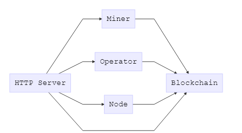
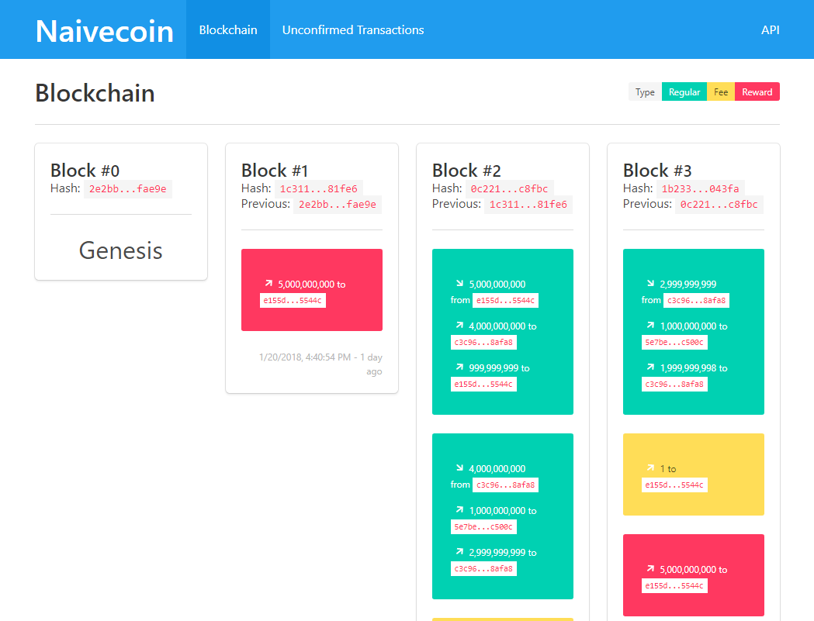

# Naivecoin - a cryptocurrency implementation in less than 1500 lines of code

[](https://travis-ci.org/conradoqg/naivecoin) [](https://coveralls.io/github/conradoqg/naivecoin?branch=master)

### Motivation
Cryptocurrencies and smart-contracts on top of a blockchain aren't the most trivial concepts to understand, things like wallets, addresses, block proof-of-work/proof-of-authority, transactions and their signatures, make more sense when they are in a broad context. Inspired by [naivechain](https://github.com/lhartikk/naivechain), this project is an attempt to provide as concise and simple an implementation of a cryptocurrency as possible.

### What is cryptocurrency
[From Wikipedia](https://en.wikipedia.org/wiki/Cryptocurrency) : A cryptocurrency (or crypto currency) is a digital asset designed to work as a medium of exchange using cryptography to secure the transactions and to control the creation of additional units of the currency.

### Key concepts of Naivecoin
* Components
    * HTTP Server
    * Node
    * Blockchain
    * Operator
    * Miner
* HTTP API interface to control everything
* Synchronization of blockchain and transactions
* Simple proof-of-work (The difficulty increases every 5 blocks) and proof-of-authority (list of allowed block sealers)
* Addresses creation using a deterministic approach [EdDSA](https://en.wikipedia.org/wiki/EdDSA)
* Data is persisted to a folder

> Naivechain uses websocket for p2p communication, but it was dropped to simplify the understanding of message exchange. It is relying only on REST communication.

#### Components communication


Not all components in this implementation follows the complete list of requirements for a secure and scalable cryptocurrency. Inside the source-code, you can find comments with `INFO:` that describes what parts could be improved (and how) and what techniques were used to solve that specific challenge.

#### HTTP Server
Provides an API to manage the blockchain, wallets, addresses, transaction creation, mining request and peer connectivity.

It's the starting point to interact with the naivecoin, and every node provides a swagger API to make this interaction easier. Available endpoints:

##### Blockchain

|Method|URL|Description|
|------|---|-----------|
|GET|/blockchain/blocks|Get all blocks|
|GET|/blockchain/blocks/{index}|Get block by index|
|GET|/blockchain/blocks/{hash}|Get block by hash|
|GET|/blockchain/blocks/latest|Get the latest block|
|PUT|/blockchain/blocks/latest|Update the latest block|
|GET|/blockchain/blocks/transactions/{transactionId}|Get a transaction from some block|
|GET|/blockchain/transactions|Get unconfirmed transactions|
|POST|/blockchain/transactions|Create a transaction|
|GET|/blockchain/transactions/unspent|Get unspent transactions|

##### Operator

|Method|URL|Description|
|------|---|-----------|
|GET|/operator/wallets|Get all wallets|
|POST|/operator/wallets|Create a wallet from a password|
|GET|/operator/wallets/{walletId}|Get wallet by id|
|GET|/operator/wallets/{walletId}/addresses|Get all addresses of a wallet|
|POST|/operator/wallets/{walletId}/transactions|Create a new transaction|
|POST|/operator/wallets/{walletId}/addresses|Create a new address|
|GET|/operator/{addressId}/balance|Get the balance of a given address|

##### Node

|Method|URL|Description|
|------|---|-----------|
|GET|/node/peer|Get the node (peer) information|
|GET|/node/peers|Get all peers connected to node|
|POST|/node/peers|Connects a new peer to node|
|GET|/node/transactions/{transactionId}/confirmations|Get how many confirmations a block has|

##### Miner

|Method|URL|Description|
|------|---|-----------|
|POST|/miner/mine|Mine a new block|

From the Swagger UI is possible to access a simple UI to visualize the blockchain and the unconfirmed transactions.



#### Blockchain

The blockchain holds two pieces of information, the block list (a linked list), and the transaction list (a hash map). 

It's responsible for:
* Verification of arriving blocks;
* Verification of arriving transactions;
* Synchronization of the transaction list;
* Synchronization of the block list;

The blockchain is a linked list where the hash of the next block is calculated based on the hash of the previous block plus the data inside the block itself:


A block is added to the block list if:
1. The block is the last one (previous index + 1);
2. The previous block is correct (previous hash == block.previousHash);
3. The hash is correct (calculated block hash == block.hash);
4. The difficulty level of the proof-of-work challenge is correct (difficulty at blockchain index _n_ < block difficulty) or if the block was sealed by one of the allowed sealers (proof-of-authority);
5. All transactions inside the block are valid;
6. The sum of output transactions are equal the sum of input transactions + 50 coins representing the reward for the block miner;
7. Check if there is a double spending in that block
8. There is only 1 fee transaction and 1 reward transaction.

A transaction inside a block is valid if:
1. The transaction hash is correct (calculated transaction hash == transaction.hash);
2. The signature of all input transactions are correct (transaction data is signed by the public key of the address);
3. The sum of input transactions are greater than output transactions, it needs to leave some room for the transaction fee;
4. The transaction isn't already in the blockchain
5. All input transactions are unspent in the blockchain.

You can read this [post](https://medium.com/@lhartikk/a-blockchain-in-200-lines-of-code-963cc1cc0e54#.dttbm9afr5) from [naivechain](https://github.com/lhartikk/naivechain) for more details about how the blockchain works.

Transactions is a list of unconfirmed transactions. Nothing special about it. In this implementation, the list of transactions contains only the unconfirmed transactions. As soon as a transaction is confirmed, the blockchain removes it from this list.

```
[
    transaction 1,
    transaction 2,
    transaction 3
]
```

A transaction is added to the transaction list if:
1. It's not already in the transaction list;
2. The transaction hash is correct (calculated transaction hash == transaction.hash);
3. The signature of all input transactions are correct (transaction data is signed by the public key of the address);
4. The sum of input transactions are greater than output transactions, it needs to leave some room for the transaction fee;
5. The transaction isn't already in the blockchain
6. All input transactions are unspent in the blockchain;

##### Block structure

A block represents a group of transactions and contains information that links it to the previous block.

```javascript
{ // Block
    "index": 0, // (first block: 0)
    "previousHash": "0", // (hash of previous block, first block is 0) (64 bytes)
    "timestamp": 1465154705, // number of seconds since January 1, 1970
    "nonce": 0, // nonce used to identify the proof-of-work step.
    "transactions": [ // list of transactions inside the block
        { // transaction 0
            "id": "63ec3ac02f...8d5ebc6dba", // random id (64 bytes)
            "hash": "563b8aa350...3eecfbd26b", // hash taken from the contents of the transaction: sha256 (id + data) (64 bytes)
            "type": "regular", // transaction type (regular, fee, reward)
            "data": {
                "inputs": [], // list of input transactions
                "outputs": [] // list of output transactions
            }
        }
    ],
    "hash": "c4e0b8df46...199754d1ed" // hash taken from the contents of the block: sha256 (index + previousHash + timestamp + nonce + transactions) (64 bytes),
    "sealer": "dda3ce5aa5...b409bf3fdc", // sealer address (64 bytes)
    "signature": "27d911cac0...6486adbf05" // hash signed with sealer address's secret key (128 bytes)
}
```

The details about the nonce (for the proof-of-work) and sealer and signature (for the proof-of-authority) algorithm used to generate the block will be described somewhere ahead.

##### Transaction structure

A transaction contains a list of inputs and outputs representing a transfer of coins between the coin owner and an address. The input list contains a list of existing unspent output transactions and it is signed by the address owner. The output list contains amounts to other addresses, including or not a change to the owner address.

```javascript
{ // Transaction
    "id": "84286bba8d...7477efdae1", // random id (64 bytes)
    "hash": "f697d4ae63...c1e85f0ac3", // hash taken from the contents of the transaction: sha256 (id + data) (64 bytes)
    "type": "regular", // transaction type (regular, fee, reward)
    "data": {
        "inputs": [ // Transaction inputs
            {
                "transaction": "9e765ad30c...e908b32f0c", // transaction hash taken from a previous unspent transaction output (64 bytes)
                "index": "0", // index of the transaction taken from a previous unspent transaction output
                "amount": 5000000000, // amount of satoshis
                "address": "dda3ce5aa5...b409bf3fdc", // from address (64 bytes)
                "signature": "27d911cac0...6486adbf05" // transaction input hash: sha256 (transaction + index + amount + address) signed with owner address's secret key (128 bytes)
            }
        ],
        "outputs": [ // Transaction outputs
            {
                "amount": 10000, // amount of satoshis
                "address": "4f8293356d...b53e8c5b25" // to address (64 bytes)
            },
            {
                "amount": 4999989999, // amount of satoshis
                "address": "dda3ce5aa5...b409bf3fdc" // change address (64 bytes)
            }
        ]
    }
}
```

#### Operator

The operator handles wallets and addresses as well the transaction creation. Most of its operation are CRUD related. Each operator has its list of wallets and addresses, meaning that they aren't synchronized between nodes.

##### Wallet structure

A wallet contains a random id number, the password hash and the secret generated from that password. It contains a list of key pairs each one representing an address.

```javascript
[
    { // Wallet
        "id": "884d3e0407...f29af094fd", // random id (64 bytes)
        "passwordHash": "5ba9151d1c...1424be8e2c", // hash taken from password: sha256 (password) (64 bytes)
        "secret": "6acb83e364...c1a04b6ee6", // pbkdf2 secret taken from password hash: sha512 (salt + passwordHash + random factor)
        "addresses": [
            {
                "index": 1,
                "secretKey": "6acb83e364...ee6bcdbc73", // EdDSA secret key generated from the secret (1024 bytes)
                "publicKey": "dda3ce5aa5...b409bf3fdc" // EdDSA public key generated from the secret (64 bytes) (also known as address)
            },
            {
                "index": 2,
                "secretKey": "072ab010ed...246ed16d26", // EdDSA secret key generated from pbkdf2 (sha512 (salt + passwordHash + random factor)) over last address secret key (1024 bytes)
                "publicKey": "4f8293356d...b53e8c5b25"  // EdDSA public key generated from the secret (64 bytes) (also known as address)
            }     
        ]
    }
]
```

##### Address structure

The address is created in a deterministic way, meaning that for a given password, the next address is created based on the previous address (or the password secret if it's the first address).

It uses the EdDSA algorithm to generate a secret public key pair using a seed that can come from a random generated value from the password hash (also in a deterministic way) or from the last secret key.

```javascript
{ // Address
    "id": "dda3ce5aa5...b409bf3fdc" // address generated from the secret (64 bytes) (also known as public key)
    "index": 1,
    "secretKey": "6acb83e364...ee6bcdbc73", // EdDSA secret key generated from the secret (1024 bytes)
    "publicKey": "dda3ce5aa5...b409bf3fdc" // EdDSA public key generated from the secret (64 bytes) (also known as address)
},
```

Only the public key is exposed as the user's address.

#### Miner

The Miner gets the list of pending transactions and creates a new block containing the transactions. By configuration, every block has at most 2 transactions in it.

Assembling a new block:
1. From the list of unconfirmed transaction selected candidate transactions that are not already in the blockchain or is not already selected;
1. Get the first two transactions from the candidate list of transactions;
2. Add a new transaction containing the fee value to the miner's address, 1 satoshi per transaction;
3. Add a reward transaction containing 50 coins to the miner's address;
4. Prove work or Prove authority for this block;

##### Proof-of-work

The proof-of-work is done by calculating the 14 first hex values for a given transaction hash and increases the nonce until it reaches the minimal difficulty level required. The difficulty increases by an exponential value (power of 5) every 5 blocks created. Around the 70th block created it starts to spend around 50 seconds to generate a new block with this configuration. All these values can be tweaked.

```javascript
const difficulty = this.blockchain.getDifficulty();
do {
    block.timestamp = new Date().getTime() / 1000;
    block.nonce++;
    block.hash = block.toHash();
    blockDifficulty = block.getDifficulty();
} while (blockDifficulty >= difficulty);
```

The `this.blockchain.getDifficulty()` returns the hex value of the current blockchain's index difficulty. This value is calculated by powering the initial difficulty by 5 every 5 blocks.

The `block.getDifficulty()` returns the hex value of the first 14 bytes of block's hash and compares it to the currently accepted difficulty. 

When the hash generated reaches the desired difficulty level, it returns the block as it is.

##### Proof-of-authority

The proof-of-authority is simpler than the proof-of-work. Every node should have the same list of allowed sealers. Right after the block is created, the miner seals the block by putting its address and signing the hash of the block.

If the node itself recognizes the sealer as one of the allowed ones, it accepts that block. To increase the practicality of this approach, every node connected must agree on the list of allowed sealers.

#### Node

The node contains a list of connected peers and does all the data exchange between nodes, including:
1. Receive new peers and check what to do with it
1. Receive new blocks and check what to do with it
2. Receive new transactions and check what to do with it

The node rebroadcasts all information it receives unless it doesn't do anything with it, for example, if it already has the peer/transaction/blockchain.

An extra responsibility is to get a number of confirmations for a given transaction. It does that by asking every node if it has that transaction in its blockchain.

#### Naivecoin configuration

In the config.js file you can change the characteristics of the coin, there you can find these options:

```js
{
    // INFO: The mining reward could decreases over time like bitcoin. See https://en.bitcoin.it/wiki/Mining#Reward.
    MINING_REWARD: 5000000000,
    // INFO: Usually it's a fee over transaction size (not quantity)
    FEE_PER_TRANSACTION: 1,
    // INFO: Usually the limit is determined by block size (not quantity)
    TRANSACTIONS_PER_BLOCK: 2,
    GENESIS_BLOCK: {
        index: 0,
        previousHash: '0',
        timestamp: 1465154705,
        nonce: 0,
        transactions: [
            {
                id: '63ec3ac02f822450039df13ddf7c3c0f19bab4acd4dc928c62fcd78d5ebc6dba',
                hash: null,
                type: 'regular',
                data: {
                    inputs: [],
                    outputs: []
                }
            }
        ]
    },
    // The chosen proof system
    PROOF_SYSTEM: 'proofOfWork',
    // Config for proofOfWork
    proofOfWork: {
        getDifficulty: (blocks, index) => {
            // Proof-of-work difficulty settings
            const BASE_DIFFICULTY = Number.MAX_SAFE_INTEGER;
            const EVERY_X_BLOCKS = 5;
            const POW_CURVE = 5;

            // INFO: The difficulty is the formula that naivecoin chose to check the proof a work, this number is later converted to base 16 to represent the minimal initial hash expected value.
            // INFO: This could be a formula based on time. Eg.: Check how long it took to mine X blocks over a period of time and then decrease/increase the difficulty based on that. See https://en.bitcoin.it/wiki/Difficulty
            return Math.max(
                Math.floor(
                    BASE_DIFFICULTY / Math.pow(
                        Math.floor(((index || blocks.length) + 1) / EVERY_X_BLOCKS) + 1
                        , POW_CURVE)
                )
                , 0);
        }
    },
    // Config for proofOfAuthority
    proofOfAuthority: {
        allowedPublicKeys: [
            'e155df3a1bac05f88321b73931b48b54ea4300be9d1225e0b62638f537e5544c'
        ]
    }
}
```

### Quick start

```sh
# Run a node
$ node bin/naivecoin.js

# Run two nodes
$ node bin/naivecoin.js -p 3001 --name 1
$ node bin/naivecoin.js -p 3002 --name 2 --peers http://localhost:3001

# Access the swagger API
http://localhost:3001/api-docs/
```

#### Example (wallet, address, transaction and mining)
```sh
# Create a wallet using password 't t t t t' (5 words)
$ curl -X POST --header 'Content-Type: application/json' -d '{ "password": "t t t t t" }' 'http://localhost:3001/operator/wallets'
{"id":"1c75fa4575fe0696323025ff61caa51653e651f92bda16c4d621be2e6a71b610","passwordHash":"e5693ac9152658239bdc1228cc1e6c1f2c2d2c0c00d288aff776e121b0289fb0","secret":null,"addresses":[]}

# Create two addresses for the wallet created (replace walletId)
$ curl -X POST --header 'Content-Type: application/json' --header 'password: t t t t t' 'http://localhost:3001/operator/wallets/1c75fa4575fe0696323025ff61caa51653e651f92bda16c4d621be2e6a71b610/addresses'
{"id":"e155df3a1bac05f88321b73931b48b54ea4300be9d1225e0b62638f537e5544c","index":1,"secretKey":"e4e0fe52363332dbd378d0aa2a4dbf73519a3df08d6708f38c7ec3bc951bab6e4ba4bac253e5e308677c2c6ff90750bf0ecfd70f0fcdea521183d76ff03c25ee4eb02fd4dd75aba7a5838167e270a40ff99a481e4090db64fa6f6963d398f4564b0641c3a26478471953a9edeffe88312959ba526c28dcbfc59c71a54ced461cdd9a6a0ad66f5696373ce6139237466de41eb7bdb07f616e70d430f2b403f818649a4c61a330686b86574fd24d3b6aee1bd691959ec5ffd0ec84b143c1e761ea91822f0f8e6d62b8419e322b9b65053fa3a5459866a191447eef4c14029ff4796bf51c31fef21b6e87c0cd4cf38ee73a2121227fc21dde51d1d4b42630bb03f9af5ac70ee34402fea120ddb5d59a63155be49b20ab8278b751766d6f238dc0cf21946beb3c697f5377f6c6adcff44d869357c758d8212a6febeb1828998f6edbba288a04b3d3253c9deca8f2d4c3ccd4e1e912f2823358f06659fab82b16273419691cdd03bc0027fa1eccbbe440ba76d200d77e9357e8b09ed38dc57fcf57598ffc44051c38ea19b2e4dbf5983182f65790a27a6d0cb0160723f1d81d85d74e1a123a88de9c840239e45a616f2478213ec6c485dc194cb78400c7aab0f990442a86edb5a5d1728049adb1ef6ca1d3bd8b46b11fcad3de01552854cf60c16f7f6babaff897c27c5690364c721ebee82a582fa5a15fd38ad50df62a5585840a5b","publicKey":"e155df3a1bac05f88321b73931b48b54ea4300be9d1225e0b62638f537e5544c"}

$ curl -X POST --header 'Content-Type: application/json' --header 'password: t t t t t' 'http://localhost:3001/operator/wallets/1c75fa4575fe0696323025ff61caa51653e651f92bda16c4d621be2e6a71b610/addresses'
{"id":"c3c96504e432e35caa94c30034e70994663988ab80f94e4b526829c99958afa8","index":2,"secretKey":"838db37e724abeb5b0ead4e9063808b03c2a84a093d0937703dfa415a71d1893c3cad7b461f13cdda6afda604120dc1f5ee78967cfd32f1a851ea5aa5a54e244402404542f0d1554f64ac4a82df84b6e5aedde3e9bb358bb8c92cfc6a4f9db9ad9fef19b76e4fec0bfc32f0edcd9923e54863a192acd9fc9c0e62852c904a02ebf726d4ecf999bd48096a4f670b5e611468704b957847b4c3dd59c181b9e2835c4d6f9741b2bf0e4fb8ac690567463dcd2df4e4124ac844163689f4438c88f44504e2a41f5671dde80c9417355626d9689e8c74df9cc730f11d0756474165733d00e3460d568e54f688ed122d44bf90fe3d194067a5aa68f88ae24fb6d4fc9bd29cf41d05bb6115e0f393a6f4fbfa74767d36b9be248e7d27b0cf55497b67ccadb2cd4369aa172a9c5e130140472eb6e86de590b75dd70b309fad2420b767abaf3e4417caee018012b835114ccd822dc355f406935c7cbfe5ab105bb31968c9f82d76baff8ec5a6b6df37d6557d395c006cba17636811cfa3e45915883b8993791dd2ed23cdd58c203aa61e1602a7ec44c1162122b480f45cd74c30c7192759df040917eeb54c3bc4fab95317d5f85d77d810f676ff4993d20da53985e32f788498fed95bfa67fbcfe1e8eadc744390d17e65468b6738afcab6692f1b43bd323fc9c0985b152df5889b62cb979f24b2614fae0ebc6c3be91286cfc5b18a139eb","publicKey":"c3c96504e432e35caa94c30034e70994663988ab80f94e4b526829c99958afa8"}

# Mine a block to the address 1 so we can have some coins
$ curl -X POST --header 'Content-Type: application/json' -d '{ "rewardAddress": "e155df3a1bac05f88321b73931b48b54ea4300be9d1225e0b62638f537e5544c" }' 'http://localhost:3001/miner/mine'
{"index":1,"nonce":25,"previousHash":"2e2bb570cc7d1220ae9caf03d4c351877e49e33629eb51deea26a5f740dfae9e","timestamp":1527913077.057,"transactions":[{"id":"8889bb69ebbbaa6accd12be21f9af913819fef47be70b5709bc379f295d6dbdc","hash":"672682e3ca8582bce752c08921334e2b943c4f86a5edd37d7db5a3c99feac5ba","type":"reward","data":{"inputs":[],"outputs":[{"amount":5000000000,"address":"e155df3a1bac05f88321b73931b48b54ea4300be9d1225e0b62638f537e5544c"}]}}],"hash":"0b179b86f320f5b1aba7709ffb8ed6af8e69eafaee379da09c935094769a4165"}

# Create a transaction that transfer 1000000000 satoshis from address 1 to address 2
$ curl -X POST --header 'Content-Type: application/json' --header 'password: t t t t t' -d '{ "fromAddress": "e155df3a1bac05f88321b73931b48b54ea4300be9d1225e0b62638f537e5544c", "toAddress": "c3c96504e432e35caa94c30034e70994663988ab80f94e4b526829c99958afa8", "amount": 1000000000, "changeAddress": "e155df3a1bac05f88321b73931b48b54ea4300be9d1225e0b62638f537e5544c" }' 'http://localhost:3001/operator/wallets/1c75fa4575fe0696323025ff61caa51653e651f92bda16c4d621be2e6a71b610/transactions'
 {"id":"8ca34efe9f5fd3c4dfb13c5406cc592a0b2e5ff55803b69ecb8066f6dabd2c8e","hash":"3a6abea85101aaa94e86b204d75f3cafb9829bff97e0149bb84e71e9669d9550","type":"regular","data":{"inputs":[{"transaction":"8889bb69ebbbaa6accd12be21f9af913819fef47be70b5709bc379f295d6dbdc","index":0,"amount":5000000000,"address":"e155df3a1bac05f88321b73931b48b54ea4300be9d1225e0b62638f537e5544c","signature":"35943565c0823ed694e3db04877c0b7fa40cdd201f433bd683edd277c52d0ee21a937776dd56544cfa353b656b1869897686496f915fabddf56dc1aeeed25000"}],"outputs":[{"amount":1000000000,"address":"c3c96504e432e35caa94c30034e70994663988ab80f94e4b526829c99958afa8"},{"amount":3999999999,"address":"e155df3a1bac05f88321b73931b48b54ea4300be9d1225e0b62638f537e5544c"}]}}

# Mine a new block containing that transaction
$ curl -X POST --header 'Content-Type: application/json' -d '{ "rewardAddress": "e155df3a1bac05f88321b73931b48b54ea4300be9d1225e0b62638f537e5544c" }' 'http://localhost:3001/miner/mine'
{"index":2,"nonce":2,"previousHash":"0b179b86f320f5b1aba7709ffb8ed6af8e69eafaee379da09c935094769a4165","timestamp":1527913123.736,"transactions":[{"id":"8ca34efe9f5fd3c4dfb13c5406cc592a0b2e5ff55803b69ecb8066f6dabd2c8e","hash":"3a6abea85101aaa94e86b204d75f3cafb9829bff97e0149bb84e71e9669d9550","type":"regular","data":{"inputs":[{"transaction":"8889bb69ebbbaa6accd12be21f9af913819fef47be70b5709bc379f295d6dbdc","index":0,"amount":5000000000,"address":"e155df3a1bac05f88321b73931b48b54ea4300be9d1225e0b62638f537e5544c","signature":"35943565c0823ed694e3db04877c0b7fa40cdd201f433bd683edd277c52d0ee21a937776dd56544cfa353b656b1869897686496f915fabddf56dc1aeeed25000"}],"outputs":[{"amount":1000000000,"address":"c3c96504e432e35caa94c30034e70994663988ab80f94e4b526829c99958afa8"},{"amount":3999999999,"address":"e155df3a1bac05f88321b73931b48b54ea4300be9d1225e0b62638f537e5544c"}]}},{"id":"c6ab84f76f7704b4988e600c33308780c587428d44d81b4ef1e8b8285ff2edb3","hash":"9f8e550c6f28dbad101ecded967835dc177585dc3e830c57ea096160fe5bee36","type":"fee","data":{"inputs":[],"outputs":[{"amount":1,"address":"e155df3a1bac05f88321b73931b48b54ea4300be9d1225e0b62638f537e5544c"}]}},{"id":"5a42245a069ca34d980a105063aa817edda272d74ec7ade7442ff7bc1c39c3b6","hash":"70813b3d6f99dcaf40ac9befe194e44d749cd65a5e4e7ca48e75a9804631efa3","type":"reward","data":{"inputs":[],"outputs":[{"amount":5000000000,"address":"e155df3a1bac05f88321b73931b48b54ea4300be9d1225e0b62638f537e5544c"}]}}],"hash":"03c7d3ee0578d9d72e1ba400b60cfc9fa78155e133d0788ef0f5fd34ea17f910"}

# Check how many confirmations that transaction has.
$ curl -X GET --header 'Content-Type: application/json' 'http://localhost:3001/node/transactions/8ca34efe9f5fd3c4dfb13c5406cc592a0b2e5ff55803b69ecb8066f6dabd2c8e/confirmations'
{"confirmations":1}

# Get address 1 balance
$ curl -X GET --header 'Content-Type: application/json' 'http://localhost:3001/operator/e155df3a1bac05f88321b73931b48b54ea4300be9d1225e0b62638f537e5544c/balance'
{"balance":9000000000}

# Get address 2 balance
$ curl -X GET --header 'Content-Type: application/json' 'http://localhost:3001/operator/c3c96504e432e35caa94c30034e70994663988ab80f94e4b526829c99958afa8/balance'
{"balance":1000000000}

# Get unspent transactions for address 1
$ curl -X GET --header 'Content-Type: application/json' 'http://localhost:3001/blockchain/transactions/unspent?address=e155df3a1bac05f88321b73931b48b54ea4300be9d1225e0b62638f537e5544c'
[{"transaction":"8ca34efe9f5fd3c4dfb13c5406cc592a0b2e5ff55803b69ecb8066f6dabd2c8e","index":1,"amount":3999999999,"address":"e155df3a1bac05f88321b73931b48b54ea4300be9d1225e0b62638f537e5544c"},{"transaction":"c6ab84f76f7704b4988e600c33308780c587428d44d81b4ef1e8b8285ff2edb3","index":0,"amount":1,"address":"e155df3a1bac05f88321b73931b48b54ea4300be9d1225e0b62638f537e5544c"},{"transaction":"5a42245a069ca34d980a105063aa817edda272d74ec7ade7442ff7bc1c39c3b6","index":0,"amount":5000000000,"address":"e155df3a1bac05f88321b73931b48b54ea4300be9d1225e0b62638f537e5544c"}]
```

#### Docker

```sh
# Build the image
$ docker build . -t naivecoin

# Run naivecoin docker container
$ ./dockerExec.sh

# Run naivecoin docker container using port 3002
$ ./dockerExec.sh -p 3002

# Naivecoin docker container options
$ ./dockerExec.sh -h
Usage: ./dockerExec.sh -a HOST -p PORT -l LOG_LEVEL -e PEERS -n NAME

# Run docker-compose with 3 nodes
$ docker-compose up
```

### Client

```sh
# Command-line options
$ node bin/naivecoin.js -h
Usage: naivecoin.js [options]

Options:
  --version                Show version number                         [boolean]
  -a, --host               Hostname. (localhost by default)
  -p, --port               HTTP port. (3001 by default)
  -l, --log-level          Log level (7=dir, debug, time and trace; 6=log and
                           info; 4=warn; 3=error, assert; 6 by default).
  -b, --broadcast-address  Broadcast address and port. (http://host:port by
                           default)
  --peers                  Peers list.                                   [array]
  --name                   Node name/identifier.
  -h, --help               Show help                                   [boolean]
```

### Development

```sh
# Cloning repository
$ git clone git@github.com:conradoqg/naivecoin.git
$ cd naivecoin
$ npm install

# Testing
$ npm test
```

### Contribution and License Agreement

If this implementation does something wrong, please feel free to contribute by opening an issue or sending a PR. The main goal of this project is not to create a full-featured cryptocurrency, but a good example of how it works.

If you contribute code to this project, you are implicitly allowing your code
to be distributed under the Apache 2.0 license. You are also implicitly verifying that
all code is your original work.

[](https://twitter.com/intent/tweet?text=Check%20it%20out%3A%20Naivecoin%20-%20a%20cryptocurrency%20implementation%20in%20less%20than%201500%20lines%20of%20code&url=%5Bobject%20Object%5D)

[](https://raw.githubusercontent.com/conradoqg/naivecoin/master/LICENSE)
